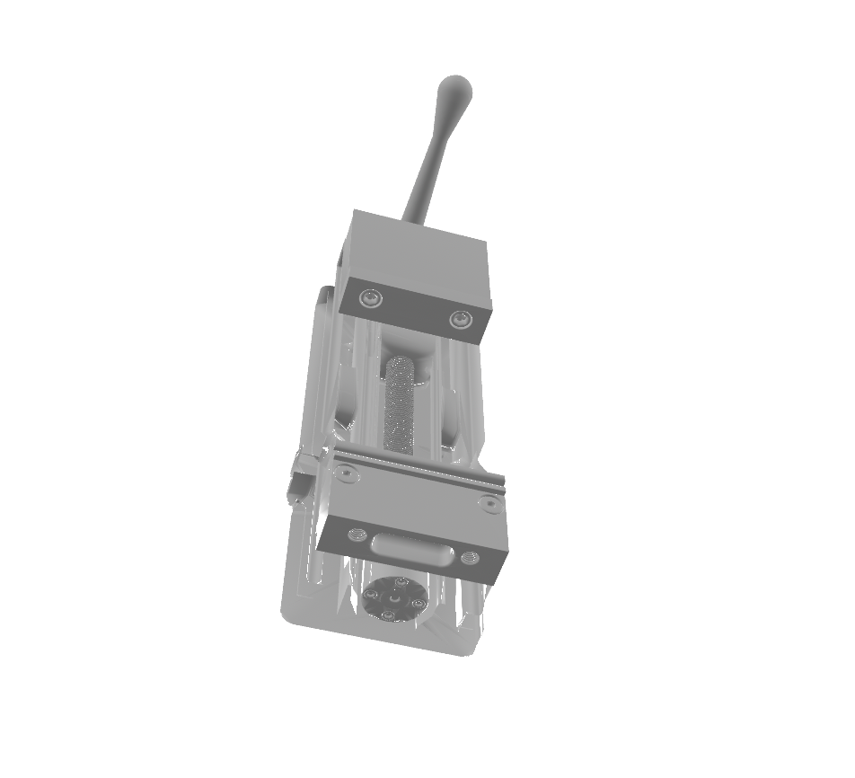

# SimReady

**Automated CAD/CAE → OpenUSD pipeline for physics-based simulation and world model training.**

SimReady converts raw mechanical STEP files into simulation-ready USD assets that meet the material fidelity, physics completeness, and semantic labeling standards required by NVIDIA Omniverse, Isaac Lab, and GR00T.

---

## What It Does

Most CAD-to-USD tools produce geometry-only assets: correct shape, wrong physics, no materials, no semantic meaning. SimReady treats material fidelity as the primary quality metric and produces assets that can drop straight into a physics simulator — including **fully articulated multi-body assemblies** with VLM-inferred kinematic joints.

```
STEP / STL / FEA mesh
        │
        ▼  Ingestion (OCC / XDE)
        │  ─ STEP product names extracted via XDE label tree
        │  ─ Assembly-level transforms baked into world-space vertices
        │  ─ Multi-body assemblies preserved with correct spatial layout
        ▼  Geometry Processing
        │  ─ Mesh cleaning + watertightness check
        │  ─ Center-of-mass pivot normalization (world origin stored for USD)
        │  ─ mm → m unit conversion (auto-detected from STEP header)
        │  ─ LOD VariantSet (100% / 50% / 25%)
        │  ─ CoACD convex decomposition for collision (pre-decimated for speed)
        ▼  Material Mapping
        │  ─ Regex/keyword classifier (zero-cost, deterministic)
        │  ─ VLM fallback (Claude API, single call per part)
        │  ─ Material confidence gate (≥ 0.8 to proceed)
        ▼  Articulation Inference  [VLM, optional]
        │  ─ Stage 1: group raw parts into rigid sub-assemblies (links)
        │  ─ Stage 2: define revolute / prismatic / fixed joints between links
        │  ─ Motion axis, rotation limits, and reasoning from Claude Opus 4.6
        ▼  USD Assembly
        │  ─ MDL / OmniPBR shader (diffuse, roughness, metallic)
        │  ─ World-space xformOp:translate on every body Xform
        │  ─ UsdPhysics: RigidBodyAPI, MassAPI, MaterialAPI
        │  ─ PhysicsRevoluteJoint / PrismaticJoint with axis + limits
        │  ─ PhysicsFilteredPairsAPI — disables collision on joint-connected links
        │  ─ SimReady semantic label on every prim
        ▼
OpenUSD (.usda / .usdc)  —  Omniverse-ready, simulation-stable
```

---

## Example: Milling-Machine Vise (Articulated Assembly)



**Source:** `data/8474A27_Milling-Machine Vise.STEP` — 14 MB, 22 solid bodies
**Result USD:** [`examples/8474A27_vise_vlm.usdc`](examples/8474A27_vise_vlm.usdc)

**Command:**

```bash
export ANTHROPIC_API_KEY=...   # required for VLM articulation inference

simready convert \
  --input  "data/8474A27_Milling-Machine Vise.STEP" \
  --output output/8474A27_vise_vlm.usda \
  --config output/vise_vlm.yaml
```

**Config** (`output/vise_vlm.yaml`):

```yaml
geometry:
  tessellation_tolerance: 0.02   # 20 mm — fast tessellation
  generate_lods: false

validation:
  strict: false
  enable_confidence_gate: false

materials:
  enable_vlm: true
  vlm_model: claude-opus-4-6
```

**VLM-inferred kinematic topology:**

```
/Root                                ArticulationRootAPI
  /Root/vise_base                    RigidBodyAPI  (16 constituent parts)
    /Root/vise_base/body_16            xformOp:translate = [0, 0.026, 0.039]
    /Root/vise_base/body_14            xformOp:translate = [0, 0.072, 0.167]
    ...  (13 more parts)
  /Root/movable_jaw                  RigidBodyAPI  (3 parts — sliding jaw)
    /Root/movable_jaw/body_0           xformOp:translate = [0, 0.030, 0.199]
    /Root/movable_jaw/body_8           xformOp:translate = [0, 0.036, -0.104]
    /Root/movable_jaw/body_17          xformOp:translate = [0, 0.036, 0.147]
  /Root/leadscrew_and_handle         RigidBodyAPI  (3 parts — rotating leadscrew)
    /Root/leadscrew_and_handle/body_9  xformOp:translate = [0, 0.036, 0.056]
    ...
  /Root/Joints/
    joint_0_prismatic                vise_base → movable_jaw
                                       axis = Y  |  limits = [-0.5, 0.5] m
    joint_1_revolute                 vise_base → leadscrew_and_handle
                                       axis = X  |  limits = [0°, 360°]

  PhysicsFilteredPairsAPI on vise_base:
    → /Root/movable_jaw              (no collision between base and sliding jaw)
    → /Root/leadscrew_and_handle     (no collision between base and leadscrew)
```

**Physics safeguards applied:**
- Each body Xform carries `xformOp:translate` = its world-space CoM in meters, so no parts overlap at simulation start
- `PhysicsFilteredPairsAPI` suppresses zero-clearance collision explosions between joint-connected links
- `physics:localRot0 / localRot1` explicitly set to identity quaternion on every joint
- Prismatic joints use a `[-0.5, 0.5] m` safe zone to prevent boundary locking at t=0

---

## Output Structure

**Single rigid body:**

```
/Root                              Z-up · meters · UsdGeom stage
  /Root/Materials/
    cast_iron                      OmniPBR MDL shader
                                   + UsdPhysics.MaterialAPI (friction, restitution)
  /Root/<PartName>                 UsdGeom.Xform
    xformOp:translate              world-space CoM position (meters)
    RigidBodyAPI
    MassAPI                        exact mass, CoM, inertia tensor
    MaterialBindingAPI
    lod VariantSet
      lod0                         full detail mesh
      lod1                         50% decimation
      lod2                         25% decimation
    /Collision_0 … N               CoACD convex hull(s) — invisible
      CollisionAPI
    customData:
      simready:semanticLabel       "mechanical:shaft"
      simready:qualityScore        0.82
      simready:watertight          true
      simready:physicsComplete     true
      simready:materialConfidence  0.92
```

**Articulated assembly (VLM-enabled):**

```
/Root                              ArticulationRootAPI
  /Root/Materials/  …
  /Root/<LinkName>                 RigidBodyAPI + MassAPI  (one per rigid group)
    /Root/<LinkName>/<PartName>    child body Xform
      xformOp:translate            world-space position
      /Collision_0 … N             CoACD hulls
    PhysicsFilteredPairsAPI        → child link paths (disables inter-link collision)
  /Root/Joints/
    joint_N_revolute               PhysicsRevoluteJoint
      physics:body0 → parent link
      physics:body1 → child link
      physics:axis, lowerLimit, upperLimit
      physics:localPos0 / localPos1
      physics:localRot0 / localRot1  (identity)
    joint_N_prismatic              PhysicsPrismaticJoint  (same attributes)
```

---

## Quality Score

Each asset receives a composite quality score written as USD `customData`:

| Component | Weight | Full credit when… |
|---|---|---|
| Watertight mesh | 30% | trimesh reports a closed manifold |
| Physics complete | 40% | density + static/dynamic friction + restitution all present |
| Material confidence | 15% | ≥ 1.0 (CAE data or high-confidence VLM) |
| Face density | 15% | ≥ 1 000 faces |

Assets below **0.8 material confidence** are quarantined before USD generation and logged to `output/low_confidence_assets.log`.

---

## Material Classification

Materials are resolved in priority order:

1. **CAE file** — Young's modulus, density, or thermal conductivity → material class derived directly.
2. **Regex / keyword pass** — part name matched against a deterministic rule set (`"_M6"` → steel, `"6061"` → aluminum). Zero cost, always runs first.
3. **VLM fallback** — when name evidence is ambiguous, a single Claude API call classifies material *and* semantic label simultaneously. Filename stem is used instead of generic body names (`body_0`, `solid_1`) so the model sees `"ISO4032_Hex_Nut_M6"` rather than a placeholder.

Supported classes: `steel`, `stainless_steel`, `aluminum`, `brass`, `bronze`, `copper`, `titanium`, `cast_iron`, `plastic_abs`, `plastic_nylon`, `plastic_pom`, `rubber`, `glass`, `ceramic`.

---

## Semantic Taxonomy

Every prim is labeled using the SimReady taxonomy `<category>:<subcategory>`:

| Category | Labels |
|---|---|
| `fastener` | `bolt` · `nut` · `washer` · `rivet` · `pin` |
| `mechanical` | `gear` · `bearing` · `shaft` · `spring` · `pulley` · `cam` |
| `structural` | `plate` · `bracket` · `beam` · `frame` · `flange` · `enclosure` |
| `fluid_system` | `pipe` · `valve` · `fitting` · `nozzle` |
| `electrical` | `connector` · `housing` |
| `industrial_part` | `component` _(fallback)_ |

---

## Quick Start

```bash
# Install
git clone https://github.com/DDBCAAAA/SimReady.git
cd SimReady
pip install -e ".[dev]"

# Convert a single STEP file (no API key required)
simready convert \
  --input  data/step_files/fasteners/ISO4032_Hex_Nut_M6.step \
  --output output/ISO4032_Hex_Nut_M6.usda

# Convert an articulated assembly with VLM inference
# Requires ANTHROPIC_API_KEY in .env
simready convert \
  --input  "data/8474A27_Milling-Machine Vise.STEP" \
  --output output/8474A27_vise_vlm.usda \
  --config output/vise_vlm.yaml

# Search and download more STEP files
simready acquire "spur gear" --max-results 20
simready acquire "ball valve" --sources github
simready catalog          # list downloaded assets
```

---

## API

```python
from pathlib import Path
from simready import pipeline

# Static single body
result = pipeline.run(
    input_path=Path("part.step"),
    output_path=Path("output/part.usda"),
    material_overrides={"*": "aluminum"},
)

# Articulated assembly with VLM topology inference
result = pipeline.run(
    input_path=Path("data/8474A27_Milling-Machine Vise.STEP"),
    output_path=Path("output/vise.usda"),
    config_path=Path("output/vise_vlm.yaml"),
)

# result dict
{
    "face_count":           1_180_000,
    "quality_score":        0.65,
    "watertight":           False,
    "physics_complete":     False,
    "material_confidence":  0.30,
    "material_class":       "steel",
}
```

---

## Architecture

```
simready/
  pipeline.py              Top-level orchestrator (6 stages)
  cli.py                   CLI: convert · acquire · catalog
  articulation_inference.py  VLM kinematic topology (rigid links + joints)
  acquisition/
    sources.py             Pluggable STEP source registry (@register_source)
    vlm_material.py        Claude API material + semantic classifier
  ingestion/
    step_reader.py         OCC/XDE STEP parser → CADBody[] (world-space verts)
    stl_reader.py          trimesh STL/OBJ/PLY reader
  geometry/
    mesh_processing.py     cleanup, LOD, CoACD decomposition, unit conversion
  materials/
    material_map.py        CAEMaterial → MDLMaterial (PBR + physics props)
  semantics/
    classifier.py          keyword → SimReady taxonomy label
  usd/
    assembly.py            OpenUSD stage builder:
                             world-space Xform translates
                             PhysicsRevoluteJoint / PrismaticJoint
                             PhysicsFilteredPairsAPI per joint pair
  validation/
    simready_checks.py     quality score, geometry and material validation
  config/
    settings.py            PipelineSettings dataclass
    defaults.yaml          default pipeline config
```

---

## Dependencies

| Package | Purpose |
|---|---|
| `usd-core` / `pxr` | OpenUSD Python bindings |
| `trimesh` | Mesh I/O, watertightness, mass properties |
| `numpy` | Geometry / linear algebra |
| `OCP` (pythonocc-core) | STEP / IGES CAD parsing via OpenCASCADE |
| `coacd` | Approximate convex decomposition for collision meshes |
| `anthropic` | Claude API — material classification + articulation inference |
| `python-dotenv` | `.env` → `ANTHROPIC_API_KEY` |
| `aiohttp` | Async HTTP for acquisition agent |

---

## Roadmap

### Done ✅
- Multi-body STEP ingestion with XDE product names
- Assembly-level OCC transforms baked into world-space vertex arrays
- Mesh cleaning, CoM pivot normalization, mm → m unit auto-detection
- 3-level LOD VariantSets
- Regex + VLM two-pass material classifier
- Filename stem fallback for generic FreeCAD body names
- Exact mass + inertia tensor from watertight mesh + material density
- CoACD convex decomposition (pre-decimated to 50K verts for runtime bound)
- UsdPhysics: RigidBodyAPI, MassAPI, MaterialAPI, RevoluteJoint, PrismaticJoint
- **VLM articulation inference** — two-stage rigid-link grouping + joint topology
- **PhysicsFilteredPairsAPI** — collision filtering between joint-connected links
- World-space `xformOp:translate` on every body Xform (no origin-overlap collapse)
- Identity quaternion initialisation on all joints (`physics:localRot0/1`)
- Material confidence gate + quality score as USD `customData`
- **P3.1** Link-level mass aggregation (parallel-axis theorem across all constituent bodies)
- Reference USD shipped in `examples/` — `8474A27_vise_vlm.usda` (22-body articulated vise)

### In Progress 🔧
- **P3.2** Full CoACD tuning per-label (tooth count → hull count heuristic for gears)
- **P3.3** World-space CoM correction for link-level MassAPI (aggregate translated body positions into true link CoM)

### Planned 📋
- **P4.1** FEA result overlay — stress/strain fields as USD primvars for training signal
- **P4.2** Omniverse Kit extension for live preview and quality dashboard
- **P4.3** Batch IGES + STEP AP242 support
- **P4.4** Multi-object scene composition — place multiple SimReady assets into a shared stage with collision-free layout

---

## License

MIT — see [LICENSE](LICENSE).

Assets in `data/` are sourced from open-licensed repositories (FreeCAD community, NIST MBE PMI, ABC Dataset). Individual file licenses are tracked in `data/catalog.json`.
